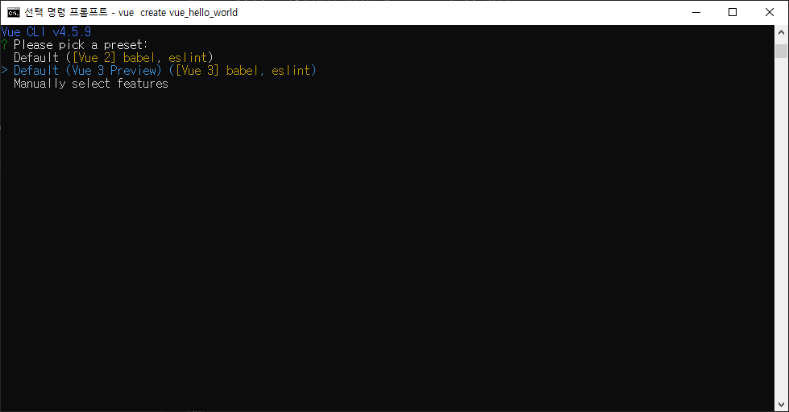
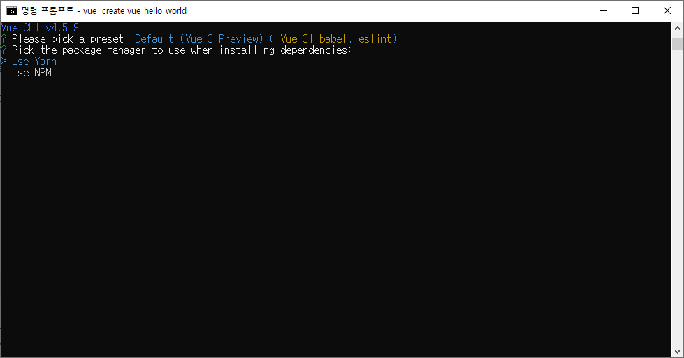

# React 시작하기 Hello world
## Node.js 설치

[Node.js 공식사이트](https://nodejs.org/en/download/)에 접속한다. 접속 후 자신의 운영체제에 맞는 버전을 선택하여 다운로드 후 설치한다.
다 default로 Next를 누르기만 하면 된다.
설치 후 cmd 창을 열어 아래 명령어로 확인한다.
```node.js
npm -v

node -v
```
버전 숫자가 나오면 무사히 설치 완료.
## yarn 설치
- yarn은 npm 문제점을 개선한 패키지 매니저로, 패키지를 훨씬 빨리 설치할 수 있다.
  - 여기서 npm은 node.js의 패키지 매니저로 Python의 pip를 생각하면 된다.
- yarn 은 [사이트](https://classic.yarnpkg.com/en/docs/install/#windows-stable)에서 설치해도 되고 npm을 통해 설치해도 된다.
- 명령어는 `npm install --global yarn`
- 설치 확인 : yarn -v

## create-react-app 설치
React 프로젝트를 생성할 때 편리하게 해주는 도구인 `create-react-app`을 설치한다.

cmd를 실행하고 아래 명령어를 입력한다.
- `npm install -g create-react-app`
- yarn을 통해 설치할 수도 있다.
  - 명령어 : `yarn global add create-react-app`
- npm은 지역적, yarn은 전역적으로 사용 가능하다고 한다.
- **모든 디렉토리에서 `create-react-app`을 사용해야하므로 yarn을 권장한다고 한다.**

## 프로젝트 생성
- cmd 창에서 프로젝트를 만들 폴더로 이동한다.
- `create-react-app hello_world` 명령어를 치면 현재 디렉토리 아래에 `hello_world` 폴더가 생가고 필요한 라이브러리들이 준비된다.
- **그런데 Windows의 경우 npx를 이용해야지 정상적으로 생성된다고 하니 npx 명령어를 쓰자(위 명령어는 터미널 환경 같다).**
  - `npm install npx -g`으로 npx를 설치한다.
  - `npx create-react-app hello_world`
  - 폴더 생성 후 프로젝트 폴더로 이동한다 : `cd hello_world`
  - yarn으로 프로젝트를 시작해본다 : `yarn start`
- cmd창에 `Success`가 뜨면 성공!
- Local 링크를 복붙하여 들어가보면 기본페이지 하나가 뜬다.
- 신기하게도 `.gitignore` 파일이 이미 있다.
  - `.gitignore` 파일이 있으면 변경내역이 19개다(프로젝트 생성 시).
  - `.gitignore` 파일을 지워봤더니 약 38000개의 파일 변경내역이 떴다..
  - 그래도 혹시몰라 [gitignore.io](https://www.toptal.com/developers/gitignore) 사이트에서 `Node` , `React`, `ReactNative`로 내용 생성 후 `.gitignore` 파일에 추가했다.
  - 총 18개의 변경내역만 git에 기록됐다.

# Vue 시작하기 Hello world
## Node.js 설치

[Node.js 공식사이트](https://nodejs.org/en/download/)에 접속한다. 접속 후 자신의 운영체제에 맞는 버전을 선택하여 다운로드 후 설치한다.
다 default로 Next를 누르기만 하면 된다.
설치 후 cmd 창을 열어 아래 명령어로 확인한다.

```node.js
npm -v

node -v
```
버전 숫자가 나오면 무사히 설치 완료.

## vue-cli 설치
vue-cli는 Vue 프로젝트를 개발할 수 있게 해주는 아주 유용한 도구이며, 여기서 CLI란 Command Line Interface의 약자로 타이핑으로 명령어를 입력하여 원하는 바를 실행시키는 도구를 말한다. Windows에서는 cmd, Mac에서는 terminal을 생각하면 된다. vue-cli는 내부적으로 Webpack을 활용한다고 한다(아직 뭔지 모르겠다). vue-cli로 명령을 실행시키면 cli가 자동으로 최적화된 Webpack형태의 결과물을 생성시켜 준다.
### vue-cli version
vue-cli 설치에 관한 조사를 하다보면 명령어가 크게 2개로 갈린다.
- `npm install -g @vue/cli`
- `npm install -g vue-cli`

이 차이는 vue-cli version에 차이가 있다. @가 있는 버전이 `vue-cli 3.xx` 버전이고 밑에 없는 버전이 `vue-cli 2.xx`버전이다. 
- **`vue-cli 3.xx`버전을 사용할 것이므로 명령어는 `npm install -g @vue/cli`을 권장한다.**
- `vue -version`를 통해 설치가 제대로 되었는지 확인한다.
  - `vue -v`를 쓰면 확인을 안해준다...ㅠ

버전의 차이는 다음과 같다.

### 프로젝트 생성
- CLI2 : eslint, unit test, night watch 등 낯선것들 선택 필요
- CLI3 : default (babel, eslint) 를 선택하면 가장 기본적인 설정으로 프로젝트가 생성, 나중에 옵션을 추가 가능작성 필요
### 프로젝트 구성
- CLI2 : simple, webpack, webpack-simple, pwa 등 템플릿 리스트 중 하나를 선택해서 프로젝트 구성
- CLI3 : 프로젝트에 플러그인 기반으로 원하는 설정 추가
### Webpack 설정 파일
- CLI2 : webpack.config.js 파일이 최상단 디렉터리에 있다.
- CLI3 : 없음, root 디렉터리에 vue.config.js 파일을 설정하고 내용 추가
### ES6 이해도
- CLI2 : 필요 X
- CLI3 : 필요 O
### node modules
- CLI2 : 자동설치 안됨. $ npm install 필요
- CLI3 : 자동설치

## 프로젝트 생성
- cmd 창에서 프로젝트를 만들 폴더로 이동한다.
- `vue create vue_hello_world` 으로 프로젝트를 생성한다.

- 생성하면 `vue please pick a preset`이란 말과 함께 `vue 2`와 `vue 3`, `select features` 중 선택하라고 창이 뜬다.
- 원래 Reference에 따르면 Default를 누르라고 하지만, Default가 2개다.
- **알아보니 vue 2에서 vue 3로 이사중이여서 버전이 다르다고 한다.**
- 고민하다가 결국 `vue 3 Default`로 설치했다.

- 또 창이 뜨는데 `Lise Yarn`을 눌러준다.
- 설치 완료 후, `vue_hello_world` 폴더로 이동한다(cd 명령어).
- `yarn serve` 명령어를 치면 local 주소가 나오면서 vue의 기본 웹페이지가 생성된다.
- 이번에도 `.gitignore` 파일이 이미 있다.
  - 똑같이 [gitignore.io](https://www.toptal.com/developers/gitignore) 사이트에서 `Node` , `Vue`, `Vuejs`로 내용 생성 후 `.gitignore` 파일에 추가했다.
  - 프로젝트 생성 시 변경내역은 11개였는데 `.gitignore` 추가해도 11개로 똑같다.

# Reference

- [[React 따라하기 #1] React 개발에 필요한 도구 설치](https://hello-bryan.tistory.com/97?category=695724)
- [윈도우10 에서 React js (create-react-app 도구) 설치하기](https://leeph.tistory.com/25?category=680041)
- [Vue Cli 초기 세팅](https://velog.io/@recordboy/Vue-Cli-%EC%B4%88%EA%B8%B0-%EC%84%B8%ED%8C%85)
- [Vue 3로 마이그레이션하기 위해 준비해야 할 것](https://ui.toast.com/weekly-pick/ko_20200804#vue-3%EB%A1%9C-%EB%A7%88%EC%9D%B4%EA%B7%B8%EB%A0%88%EC%9D%B4%EC%85%98%ED%95%98%EA%B8%B0-%EC%9C%84%ED%95%B4-%EC%A4%80%EB%B9%84%ED%95%B4%EC%95%BC-%ED%95%A0-%EA%B2%83)